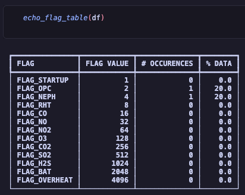

.. highlight:: sh

Usage 
#####

The primary purpose of the *quantaq-cli* is to make it easier for you - the user - to munge and analyze 
your sensor data. A quick overview of the available functions and commands are below, with more detailed documentation 
on their complete functionality in the :doc:`api`.

Using quantaq-cli in a Python script
------------------------------------

The following functions can be imported directly from the *quantaq_cli* library:

* **safe_load** reads CSV or Parquet files into a pandas DataFrame, handling
  the various QuantAQ sensor header formats and schema types automatically.

  .. code-block:: python 

    from quantaq_cli import safe_load

    df = safe_load('/PATH/TO/FILE.CSV')

    # we can optionally choose not to standardize the schema
    df = safe_load('/PATH/TO/FILE.CSV', standardize_schema=False)

* **concat_files** enables you to concatenate large groups of files row-wise into
  one DataFrame, aligning columns by label.

  .. code-block:: python 
    
    from quantaq_cli import concat_files

    df = concat_files(['/PATH/TO/FILE1.CSV', 
                        '/PATH/TO/FILE2.CSV',
                        '/PATH/TO/FILE3.CSV'])

* **merge_files** enables you to merge two files column-wise into one DataFrame,
  aligning rows by timestamp. 

  .. code-block:: python 
    
    from quantaq_cli import merge_files

    df = merge_files(['/PATH/TO/FILE1.CSV', '/PATH/TO/FILE2.CSV'])

    # you can override the name of the timestamp column, the suffixes attached to
    # duplicated column names, and whether to keep both duplicated columns or
    # only the left/right file's version
    df = merge_files(['/PATH/TO/FILE1.CSV', '/PATH/TO/FILE2.CSV'],
                      tscol="timestamp",
                      suffixes=('_left', '_right'),
                      keep="both")

    df = merge_files(['/PATH/TO/FILE1.CSV', '/PATH/TO/FILE2.CSV'],
                      tscol="timestamp",
                      suffixes=('', '_drop'),
                      keep="left")

* **flag_dataframe** flags rows that do not meet QuantAQ's default
  QA/QC checks.

  .. code-block:: python 
    
    from quantaq_cli import flag_dataframe

    df_new = flag_dataframe(df)

* **echo_flag_table** allows you to view a summary of the flag statistics for 
  a DataFrame.

  .. code-block:: python 
    
    from quantaq_cli import echo_flag_table

    echo_flag_table(df)

  .. image:: flag-output2.png

* **resample_dataframe** helps you up- or down-sample your data, with safe
  handling of mixed dtypes, wind columns, and flag columns.

  .. code-block:: python 
    
    from quantaq_cli import resample_dataframe

    # the only required arguments are the dataframe you'd like to flag and the 
    # target resampling rule (i.e. "1min", "1h", "1D")
    df_hourly = resample_dataframe(df, "1h")

    # we can optionally implement flag-aware resampling (see API Reference)
    df_hourly = resample_dataframe(df, "1h", flag_aware=True)

    # you can also override the name of the timestamp column to resample on, 
    # the column(s) to group by first (i.e. ``sn`` so that unique devices are 
    # resampled independently, the names of the wind columns, and the aggregate
    # methods used for numeric and non-numeric columns.
    df_daily = resample_dataframe(
        df,
        "1D",
        on="timestamp",
        by="sn",
        wind=("wx_u", "wx_v", "wx_ws", "wx_wd"),
        flag_aware=True,
        numeric_how="mean",
        nonnumeric_how="first",
    )

* **expunge_dataframe** sets the appropriate columns to NaN for rows with 
  flagged data. This means that the columns associated with a given flag 
  are set to NaN's whenever that flag is set. For more information on the sensor-specific 
  flags, please check out your sensors documentation. 

  .. code-block:: python 
    
    from quantaq_cli import expunge_dataframe
    df_new = expunge_dataframe(df)

* **clean_dataframe** converts timestamps to sorted, timezone-aware datetime objects;
  standardizes the schema and optionally coerces dtypes; drop rows where are columns
  are NaN; removes unnamed columns. 

  .. code-block:: python 
    
    from quantaq_cli import clean_dataframe
    df_new = clean_dataframe(df)

Using the command-line interface
--------------------------------

* To use the **concat** command, you must provide either a list of files or a 
  wildcard argument that will glob all the files together.
 
  Below is an example of a wildcard argument that will grab all files in the directory that begin with **data** and 
  are **.csv**'s. We would expect this command to concatenate all of those files and output them to **path/output.csv**.

  Additionally, the log level has been set to *DEBUG* which will log additional debugging information to 
  the console.

.. code-block:: bash

    $ quantaq-cli concat --log-level DEBUG -o path/output.csv path/data*.csv

If you wanted to explicitly define the individual files to concatenate, you can do that as well:

.. code-block:: bash

    $ quantaq-cli concat path/file-1.csv path/file-2.csv

This time, we didn't define the output path (**-o**), so the default will be used which will save the file 
to your current working directory.    

.. warning::

    Arguments must come at the **end** of the command. For this CLI, this usually means the filepath for the
    files being read in. However, you can always check the :doc:`api` for complete documentation.

* The **merge** command can, for example, be used to combine **raw** and **final** data files 
  (or sensor data and reference station data) column-wise based on their timestamp. 

  .. code-block:: bash

        $ quantaq-cli merge path/data_raw.csv path/data_final.csv

  If we want to override the name of the timestamp column to one named *timestamp_local*:

  .. code-block:: bash

        $ quantaq-cli merge --tscol timestamp_local path/data_sensor.csv path/data_reference.csv

  If we only want to keep overlapping columns from the sensor data:

  .. code-block:: bash

        $ quantaq-cli merge --suffixes "" _drop --keep left path/data_sensor.csv path/data_reference.csv

.. warning::

    The timestamp column name must be the same in all files.

* The **flag** command will override the flags in the `flag` column and re-flag 
  data based on QuantAQ's most recent (as of July 2026) QA/QC checks.

  .. code-block:: bash

        $ quantaq-cli flag path/data.csv

* The **resample** command only requires the file path and the target resampling 
  rule (i.e. "1min", "1h", "1D")

  .. code-block:: bash

        $ quantaq-cli resample path/data.csv 1h

  If we want to override the name of the timestamp column to one named *timestamp_local*:

  .. code-block:: bash

        $ quantaq-cli resample --on timestamp_local path/data.csv 1h 
    
  If we want to implement flag-aware resampling:

  .. code-block:: bash

        $ quantaq-cli resample --flag-aware path/data.csv 1h

See the :doc:`api` for how to override other default resampling options.

###############################################################################
## to do: modify docs after this point ########################################

If you running with the verbose flag set (**-v, --verbose**) or with the dry-run 
(**-d, --dry-run**) flag set, a table with the flag report will be output to the 
terminal screen.

For example, we can run the default **expunge** command in dry-run mode:

.. code-block:: bash 

    $ quantaq-cli expunge --dry-run -m v200 path/file-1.csv

When you run this, you will see a report generated which will look something 
like:

It contains the name of each possible flag, the flag's value, the number of 
occurences, and the percentage of time the flag was set.

To run normally with all defaults:

.. code-block:: bash

    $ quantaq-cli expunge -v -m v200 path/file-1.csv

Resample Data
^^^^^^^^^^^^^

The **resample** command makes it easy to up- or down-sample your data 
(e.g., converting your secondly data into 5-minutely data). The only 
required columns are the **FILE** and the **INTERVAL**. The **INTERVAL** should be a 
string that contains both the number and sampling interval, where available sampling 
interval definitions are below:

* **M** : month
* **W** : week
* **d**: day
* **h** : hour
* **min** : minute
* **s** : second
* **ms**: millisecond

So, if you wanted to resample your data from 1-second frequency to 5-minute frequency, 
your **INTERVAL** would be **5min**.

In addition to required arguments, there are a few options including the **method** 
(-m, --method) and the **tscol** (-ts, --tscol). The **tscol** allows you to 
override the name of the timestamp column which is **timestamp** by default. The 
**method** column allows you to override the method by which you resample, which 
defaults to **mean**. Available options for **method** are **mean**, **median**, 
**sum**, **min**, and **max**.

Now, for some examples!

If we want to take our data file which is at 10-second frequency and output a 
file that is 5-minute averaged:

.. code-block::

    $ quantaq-cli resample -v path/file-1.csv 5min

If we want to do the same, but get the median of each 5-min interval instead of 
the mean:

.. code-block::

    $ quantaq-cli resample -v -m median path/file-1.csv 5min

What if we have a different timestamp colum named **col_time** and want the 24 hour average?

.. code-block::

    $ quantaq-cli resample -v -ts col_time path/file-1.csv 24h

.. warning:: 

    When resampling your data, any non-numeric columns will be dropped.

Clean Data
^^^^^^^^^^

The **clean** command removes any corrupt data from a file and forces the column 
types to their desired dtype to reduce storage requirements. The command only works on single 
files (as of now) and it drops any records that have any corrupt data. 

Below is an quick example demonstrating how the **clean** command can be used to clean up 
a corrupt data file.

.. code-block::

    $ quantaq-cli clean raw/sensor-file.csv munged/sensor-file.csv 

Playbook
--------

.. note::

    Feather-format data. Feather is a fast, lightweight, easy-to-use binary file 
    format for storing data frames that is programming-language agnostic and 
    extremely efficient when working with time-series data. The process of 
    converting string to python datetime objects is fairly inefficient, especially 
    for large data files. Thus, if working with large files and you desire to 
    manipulate time-series data, it is highly recommended that you use the 
    feather file format! 

    This is supported by this CLI by simply defining the output file with a 
    file extension that is **.feather**.

This playbook contains an example of a common workflow for QuantAQ users - you
have a ton of raw and final data files, and you need to concatenate them, merge 
them together, and then expunge them. We will also throw in a few optional 
flagging steps just to show you how it could be incorporated. This entire workflow 
could be automated using a tool such as `Snakemake <https://snakemake.readthedocs.io/en/stable/>`_ or via bespoke bash commands/files.

How to munge and clean your data
^^^^^^^^^^^^^^^^^^^^^^^^^^^^^^^^

First, we will assume there is some directory containing all files with 
two subdirectories called **raw** and **final**. Additionally, we have an 
extra folder to hold our munged data:

.. code-block::

    dir/
    dir/raw/*
    dir/final/*
    dir/munged/

We begin by concatenating together all raw files into a single file called 
**dir/munged/concat-raw.feather** and do the same for the final data files and 
save to **dir/munged/concat-final.feather**. We assume that all files in the 
respective directories are csv's and we are using all of them.

.. code-block:: bash

    $ quantaq-cli concat -v -o dir/munged/concat-raw.feather dir/raw/*.csv
    $ quantaq-cli concat -v -o dir/munged/concat-final.feather \
                    dir/final/*.csv

At this point, we have two large files. Next, we will **merge** the two files 
together into a single file called **dir/munged/merged.feather**:

.. code-block:: bash 

    $ quantaq-cli merge -v -o dir/munged/merged.feather \
            dir/munged/concat-raw.feather dir/munged/concat-final.feather

Next, let's (optionally) flag the data based on temperature to throw out 
any periods that have truly ridiculous values (which likely means the sensor 
was misbehaving):

.. code-block:: bash 

    $ quantaq-cli flag -v -o dir/munged/tmp.feather dir/munged/merged.feather \
            temp_manifold ge 100
    
Next, we will **expunge** the data and set the flagged data to NaN's:

.. code-block:: bash

    $ quantaq-cli expunge -v -o dir/munged/expunged.feather dir/munged/tmp.feather

At this point, we could stop as we have a file (**expunged.feather**) that 
contains the final, de-flagged data. However, it is likely still at a 10-second 
sample frequency which is a lot of data! Let's go ahead and **resample** it 
to both 1min and 5min intervals:

.. code-block:: bash 

    $ quantaq-cli resample -v -o dir/munged/final-1min.csv dir/expunged.feather 1min
    $ quantaq-cli resample -v -o dir/munged/final-5min.csv dir/expunged.feather 5min

And that's it! Just ~7 bash commands and you've gone from two directories full of data 
to 2 files that contain the final 1min and 5min sampled data!