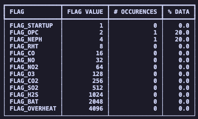

.. highlight:: sh

Usage 
#####

The primary purpose of the *quantaq-cli* is to make it easier for you - the user - to munge and analyze 
your sensor data. A quick overview of the available functions and commands are below, with more detailed documentation 
on their complete functionality in the :doc:`api`.

Using quantaq-cli in a Python script
------------------------------------

Importing functions
^^^^^^^^^^^^^^^^^^^

For each of the below functions, you can import them all using the toolkit module:

  .. code-block:: python 

    from quantaq_cli import toolkit

This allows us to access functions using ``toolkit.<function_name>``:

You can also import these functions directly from the *quantaq_cli* library:

  .. code-block:: python 

    from quantaq_cli import safe_load, concat_files, merge_files 
    from quantaq_cli import echo_flag_dataframe, flag_dataframe
    from quantaq_cli import resample_dataframe, expunge_dataframe, clean_dataframe

safe_load()
^^^^^^^^^^^

* ``safe_load()`` reads CSV or Parquet files into a pandas DataFrame, handling
  the various QuantAQ sensor header formats and schema types automatically.

  .. code-block:: python 

    from quantaq_cli import safe_load

    df = safe_load('/PATH/TO/FILE.CSV')

By default, ``safe_load()`` validates the schema — checking that column
names and dtypes conform to the standardized schema, and coercing them if
they don't. If you don't want your column names changed, set
``validate_dataframe_schema`` to ``False``:

  .. code-block:: python 

    from quantaq_cli import safe_load

    df = safe_load('/PATH/TO/FILE.CSV', validate_dataframe_schema=False)

.. warning::

    ``flag_dataframe()`` and ``expunge_dataframe()`` require validated schemas.

concat_files()
^^^^^^^^^^^^^^

* ``concat_files()`` enables you to concatenate large groups of files row-wise into
  one DataFrame, aligning columns by label.

  .. code-block:: python 
    
    from quantaq_cli import concat_files

    df = concat_files(['/PATH/TO/FILE1.CSV', 
                        '/PATH/TO/FILE2.CSV',
                        '/PATH/TO/FILE3.CSV'])

merge_files()
^^^^^^^^^^^^^

* ``merge_files()`` enables you to merge two files column-wise into one DataFrame,
  aligning rows by timestamp. 

  .. code-block:: python 
    
    from quantaq_cli import merge_files

    df = merge_files(['/PATH/TO/FILE1.CSV', '/PATH/TO/FILE2.CSV'])

    # you can override the name of the timestamp column, the suffixes attached to
    # duplicated column names, and whether to keep both duplicated columns or
    # only the left/right file's version
    df = merge_files(['/PATH/TO/SENSOR.CSV', '/PATH/TO/REFERENCE.CSV'],
                      tscol="timestamp",
                      suffixes=('_sens', '_ref'),
                      keep="both")

    df = merge_files(['/PATH/TO/FILE1.CSV', '/PATH/TO/FILE2.CSV'],
                      tscol="timestamp",
                      keep="left")

flag_dataframe()
^^^^^^^^^^^^^^^^

* ``flag_dataframe()`` flags rows that do not meet QuantAQ's default
  QA/QC checks.

  .. code-block:: python 
    
    from quantaq_cli import flag_dataframe

    df_new = flag_dataframe(df)

echo_flag_table()
^^^^^^^^^^^^^^^^^

* ``echo_flag_table()`` allows you to view a summary of the flag statistics for 
  a DataFrame.

  .. code-block:: python 
    
    from quantaq_cli import echo_flag_table

    echo_flag_table(df)

  .. image:: flag-output2.png

resample_dataframe()
^^^^^^^^^^^^^^^^^^^^

* ``resample_dataframe()`` helps you up- or down-sample your data, with safe
  handling of mixed dtypes, wind columns, and flag columns.

  .. code-block:: python 
    
    from quantaq_cli import resample_dataframe

    # the only required arguments are the dataframe you'd like to flag and the 
    # target resampling rule (i.e. "1min", "1h", "1D")
    df_hourly = resample_dataframe(df, "1h")

    # we can optionally implement flag-aware resampling (see API Reference)
    df_hourly = resample_dataframe(df, "1h", flag_aware=True)

    # you can also override the name of the timestamp column to resample on, 
    # the column(s) to group by first (i.e. ``sn`` so that unique devices are 
    # resampled independently, the names of the wind columns, and the aggregate
    # methods used for numeric and non-numeric columns.
    df_daily = resample_dataframe(
        df,
        "1D",
        on="timestamp",
        by="sn",
        wind=("wx_u", "wx_v", "wx_ws", "wx_wd"),
        flag_aware=True,
        numeric_how="mean",
        nonnumeric_how="first",
    )

expunge_dataframe()
^^^^^^^^^^^^^^^^^^^

* ``expunge_dataframe()`` sets the appropriate columns to NaN for rows with 
  flagged data. This means that the columns associated with a given flag 
  are set to NaN's whenever that flag is set. For more information on the sensor-specific 
  flags, please check out your sensors documentation. 

  .. code-block:: python 
    
    from quantaq_cli import expunge_dataframe
    df_new = expunge_dataframe(df)

clean_dataframe()
^^^^^^^^^^^^^^^^^

* ``clean_dataframe()`` converts timestamps to sorted, timezone-aware datetime objects;
  standardizes the column names and dtypes; drop rows where all columns
  are NaN; and removes unnamed columns. 

  .. code-block:: python 
    
    from quantaq_cli import clean_dataframe
    df_new = clean_dataframe(df)

configure_logging
^^^^^^^^^^^^^^^^^

To configure the log-level, import the configure_logging() function:

  .. code-block:: python

    from quantaq_cli.log import configure_logging
    configure_logging("DEBUG")

Accepted values for the log level config are:
``DEBUG``, ``INFO``, ``WARNING``, and ``ERROR``. The default is ``INFO``.

Using the command-line interface
--------------------------------

The CLI tool allows you to use the functions above as commands that can be run directly 
against files from the command line. Each command takes a filepath (or, for some 
commands, a list of filepaths) as input. For functions that operate on pandas DataFrames
(i.e., flag_dataframe(), expunge_dataframe(), and clean_dataframe())
the command first loads the file via safe_load(), then passes the resulting DataFrame 
to the underlying function.

The commands include: **concat**, **merge**, **resample**,
**flag**, **expunge**, and **clean**.

concat
^^^^^^
* The **concat** command applies the ``concat_files()`` function to the specified data files. 
  You must provide either a list of files or a  wildcard argument that will glob all the files together.

  .. code-block:: bash

    $ quantaq-cli concat path/data*.csv

If you wanted to explicitly define the individual files to concatenate, you can do that as well:

  .. code-block:: bash

    $ quantaq-cli concat path/file-1.csv path/file-2.csv

For each command, you can specify the output path using the :option:`-o, --output` option. 
Otherwise, the default will be used which will save the file to your current
working directory.

    .. code-block:: bash

      $ quantaq-cli concat -o path/output.csv path/data*.csv

For each command, you can also specify the log level to control the verbosity of log output
using :option:`--log-level`:

    .. code-block:: bash

      $ quantaq-cli concat --log-level DEBUG path/data*.csv

Accepted values for :option:`--log-level` are:
``DEBUG``, ``INFO``, ``WARNING``, and ``ERROR``. The default is ``INFO``. 

  .. warning::

    Arguments must come at the **end** of the command. For this CLI, this usually means the filepath for the
    files being read in. However, you can always check the :doc:`api` for complete documentation.

merge
^^^^^

* The **merge** command applies the ``merge_files()`` function to the specified data files. 
  function. It can, for example, be used to combine **raw** and **final** data files 
  (or sensor data and reference station data) column-wise based on their timestamp. 

    .. code-block:: bash

      $ quantaq-cli merge path/data_raw.csv path/data_final.csv

  If we want to override the name of the timestamp column to merge on to one named *timestamp_local*
  use :option:`--tscol`:

    .. code-block:: bash

      $ quantaq-cli merge --tscol timestamp_local path/data_sensor.csv path/data_reference.csv

  .. warning::

    The timestamp column name must be the same in both files.

  For files with duplicated columns, the default is to keep both sets of columns,
  disambiguated by suffix:

    .. code-block:: bash

      $ quantaq-cli merge --suffixes _left _right --keep both path/data_sensor.csv path/data_reference.csv

  You can override that and only keep duplicated columns from the left file (the sensor data) or
  right file (the reference data). 

    .. code-block:: bash

      $ quantaq-cli merge --keep left path/data_sensor.csv path/data_reference.csv

flag
^^^^

* The **flag** command loads the specified file and applies the ``flag_dataframe()``
  function. 

  .. code-block:: bash

      $ quantaq-cli flag path/data.csv

resample
^^^^^^^^

* The **resample** command loads the specified file and applies the ``resample_dataframe()``
  function. The command also requires the target resampling rule (i.e. "1min", "1h", "1D")
  to be specified:

  .. code-block:: bash

      $ quantaq-cli resample path/data.csv 1h

  If we want to override the name of the timestamp column to resample on to one
  named *timestamp_local* use :option:`--on`:

  .. code-block:: bash

      $ quantaq-cli resample --on timestamp_local path/data.csv 1h 
    
  If you want to implement flag-aware resampling, simply use the :option:`--flag-aware` flag:

  .. code-block:: bash

      $ quantaq-cli resample --flag-aware path/data.csv 1h

  See the :doc:`api` for how to override other default resampling options.

expunge
^^^^^^^

* The **expunge** command loads the specified file and applies the ``expunge_dataframe()``
function:

  .. code-block:: bash

      $ quantaq-cli expunge path/data.csv 

If you run with the log level set to **INFO** using :option:`--log-level`, or with the dry-run 
(:option:`--dry-run`) flag set, a table with the flag report will be output to the 
terminal screen.

For example, we can run the default **expunge** command in dry-run mode:

.. code-block:: bash 

    $ quantaq-cli expunge --dry-run path/file-1.csv

When you run this, you will see a report generated which will look something 
like:

It contains the name of each possible flag, the flag's value, the number of 
occurences, and the percentage of time the flag was set. Dry-run will not save
the expunged dataframe.

Clean
^^^^^

The **clean** command loads the specified file and applies the ``clean_dataframe()``
function:

.. code-block::

    $ quantaq-cli clean raw/sensor-file.csv 

Playbook
--------

Check out the examples under *notebooks/example.ipynb* for an example workflow 
for QuantAQ users using the quantaq-cli Python library.

For an example workflow using the CLI tool, follow the Playbook below.

How to munge and clean your data
^^^^^^^^^^^^^^^^^^^^^^^^^^^^^^^^

First, we will assume there is some directory containing all files with 
two subdirectories called **raw** and **final**. Additionally, we have an 
extra folder to hold our munged data:

.. code-block::

    dir/
    dir/raw/*
    dir/final/*
    dir/munged/

We begin by concatenating together all raw files into a single file called 
**dir/munged/concat-raw.csv** and do the same for the final data files and 
save to **dir/munged/concat-final.csv**. We assume that all files in the 
respective directories are csv's and we are using all of them.

.. code-block:: bash

    $ quantaq-cli concat -o dir/munged/concat-raw.csv dir/raw/*.csv
    $ quantaq-cli concat -o dir/munged/concat-final.csv \
                    dir/final/*.csv

At this point, we have two large files. Next, we will **merge** the two files 
together into a single file called **dir/munged/merged.csv**:

.. code-block:: bash 

    $ quantaq-cli merge -o dir/munged/merged.csv \
            dir/munged/concat-raw.csv dir/munged/concat-final.csv

Next, let's (optionally) re-flag the data to make sure it matches QuantAQ's default
QA/QC checks. 

.. code-block:: bash 

    $ quantaq-cli flag -o dir/munged/tmp.csv dir/munged/merged.csv
    
Next, we will **expunge** the data and set the flagged data to NaN's:

.. code-block:: bash

    $ quantaq-cli expunge -o dir/munged/expunged.csv dir/munged/tmp.csv

At this point, we could stop as we have a file (**expunged.csv**) that 
contains the final, de-flagged data. However, it is likely still at a 5-second 
sample frequency which is a lot of data! Let's go ahead and **resample** it 
to both 1min and 5min intervals:

.. code-block:: bash 

    $ quantaq-cli resample -o dir/munged/final-1min.csv dir/expunged.csv 1min
    $ quantaq-cli resample -o dir/munged/final-5min.csv dir/expunged.csv 5min

And that's it! Just ~7 bash commands and you've gone from two directories full of data 
to 2 files that contain the final 1min and 5min sampled data!
